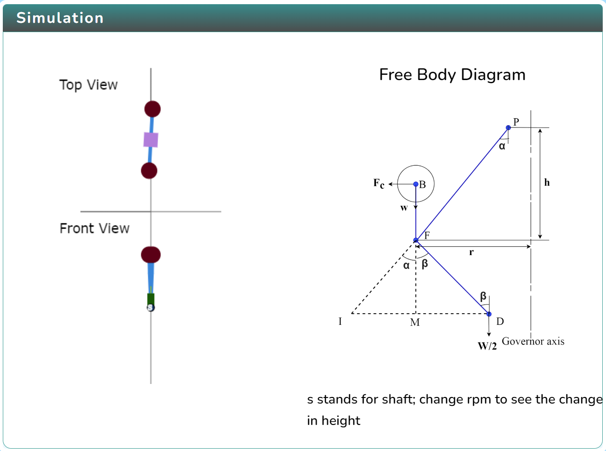
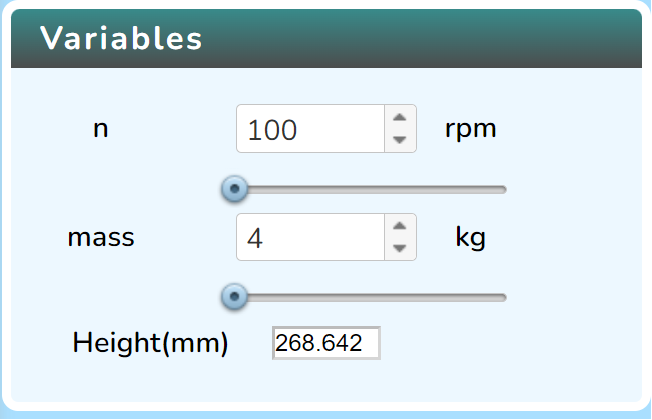
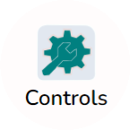
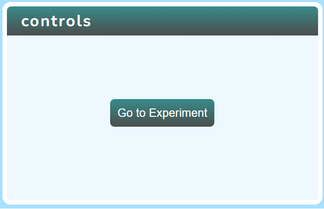
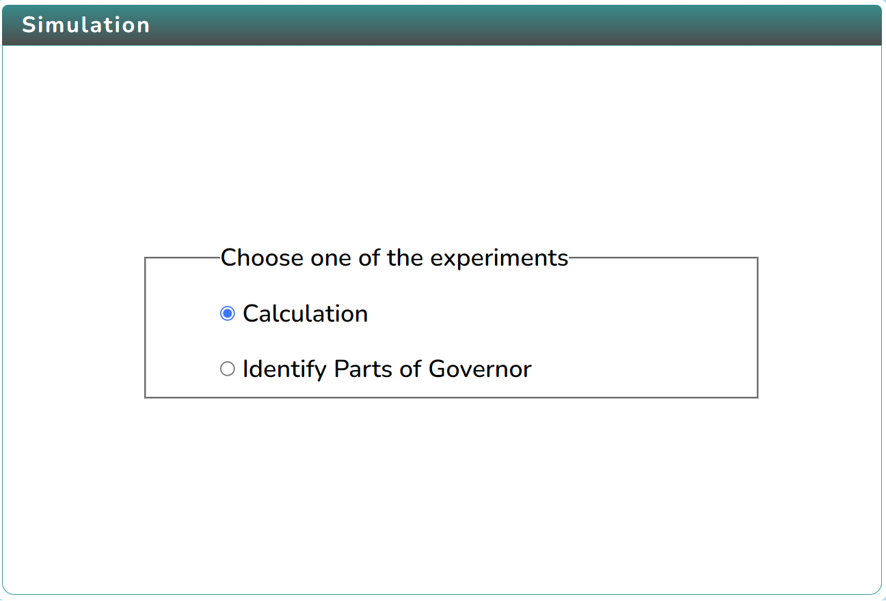
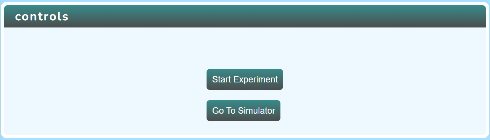
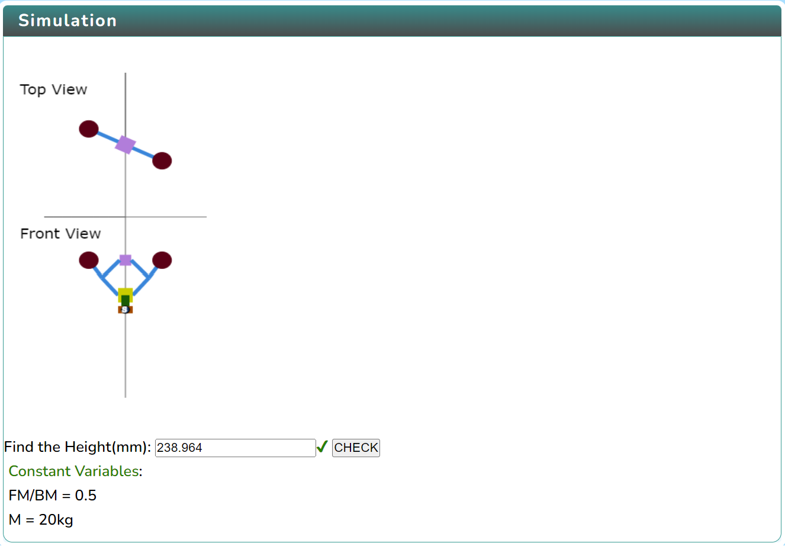
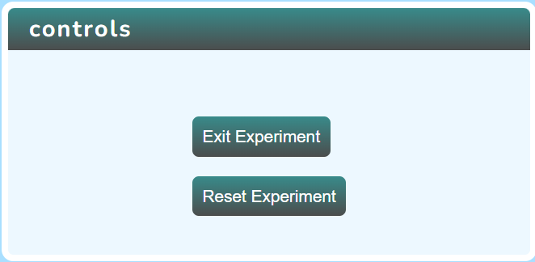

### Procedure

  Click on the Simulation icon      to view the simulation screen. 

   
   
   In order to view the variable section click on the Variable icon. 

   
   

  In order to view the control section click on the Control icon. 

   
  Click on the "Go to Experiment" button in the control section.

   

   Click on the Graph icon  to view the graph.

 Choose any one of the experiments in the given option.
   
   

   Click on the "Start experiment" button in the control section.

   

   Enter the input values and then click on the "Check" button to find the right answer.

   

   Click on the "Exit Experiment" or "Reset Experiment" button to exit or reset the experiment.

   

